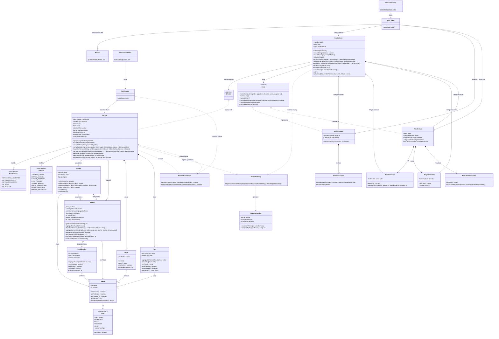

# Diagrama de Clases — Canasta

```mermaid
classDiagram
direction TB

    class LanzadorCliente {
        +main(String[] args)$ void
    }

    class AppCliente {
        +start(Stage stage)
    }

    class Puertos {
        +primerLibre(int desde)$ int
    }

    class LanzadorServidor {
        +main(String[] args)$ void
    }

    class AppServidor {
        +start(Stage stage)
    }

    class IVista {
        <<interface>>
        +mostrarSala(List~Jugador~ jugadores, Jugador admin, Jugador yo)
        +mostrarJuego()
        +mostrarMesa(...)
        +mostrarResultado(String mensajeFinal, List~RegistroRanking~ ranking)
        +mostrarMensaje(String mensaje)
        +mostrarError(String mensaje)
    }

    class Controlador {
        -IPartida modelo
        -IVista vista
        -String nombreLocal
        +setVista(IVista vista)
        +entrar(String nombre) boolean
        +iniciarPartida(int puntajeObjetivo)
        +robarDelMazo()
        +tomarPozo(List~Integer~ indicesMano, Integer indiceJuegoMesa)
        +bajarCombinacion(List~Integer~ indicesCartas, boolean esOculta)
        +agregarACombinacion(int indiceJuegoMesa, List~Integer~ indicesCartas)
        +deshacerJugadasTurno()
        +descartar(int indiceCarta)
        +cerrarMano(int indiceCartaDescarte)
        +salir()
        +actualizar(IObservableRemoto observable, Object evento)
    }

    class VistaConsola {
        -VentanaConsola ventana
        -Controlador controlador
        +setControlador(Controlador controlador)
    }

    class VentanaConsola {
        +setManejadorEntrada(Consumer~String~ manejadorEntrada)
        +escribir(String texto)
    }

    class VistaGrafica {
        -Stage stage
        -Controlador controlador
        -SalaController salaController
        -JuegoController juegoController
        -ResultadoController resultadoController
    }

    class SalaController {
        -Controlador controlador
        +getVista() Parent
        +mostrar(List~Jugador~ jugadores, Jugador admin, Jugador yo)
    }

    class JuegoController {
        -Controlador controlador
        +getVista() Parent
        +mostrarMesa(...)
    }

    class ResultadoController {
        +getVista() Parent
        +mostrar(String mensajeFinal, List~RegistroRanking~ ranking)
    }

    class Palo {
        <<enumeration>>
        CORAZONES
        DIAMANTES
        PICAS
        TREBOLES
        JOKER
        -boolean esRojo
        +esRojo() boolean
    }

    class EstadoTurno {
        <<enumeration>>
        ESPERANDO_JUGADORES
        ESPERANDO_ROBO
        ESPERANDO_ACCION
        FIN_MANO
        FIN_PARTIDA
    }

    class Eventos {
        <<enumeration>>
        JUGADOR_UNIDO
        PARTIDA_INICIADA
        CARTAS_ROBADAS
        POZO_TOMADO
        JUGADA_BAJADA
        CARTA_DESCARTADA
        MANO_FINALIZADA
        PARTIDA_FINALIZADA
    }

    class Carta {
        -Palo palo
        -int numero
        +esComodin() boolean
        +esTresRojo() boolean
        +esTresNegro() boolean
        +getPuntaje() int
        +formatoNumero(int numero)$ String
    }

    class Combinacion {
        -int numeroBase
        -List~Carta~ cartas
        -boolean esOculta
        +agregarCartas(List~Carta~ nuevas)
        +esCanasta() boolean
        +esLimpia() boolean
        +esSucia() boolean
        +calcularPuntaje() int
    }

    class Jugador {
        -String nombre
        -List~Carta~ mano
        -Equipo equipo
        +recibirCarta(Carta carta)
        +quitarCartaPorIndice(int indice) Carta
        +obtenerCartasPorIndices(List~Integer~ indices) List~Carta~
        +quitarCartas(List~Carta~ aQuitar)
        +vaciarMano()
        +ordenarMano()
    }

    class Equipo {
        -String nombre
        -List~Jugador~ integrantes
        -List~Combinacion~ juegosEnMesa
        -List~Carta~ tresRojos
        -int puntajeTotal
        -boolean abrioEnManoActual
        -int turnoCanastaLimpia
        +getPuntosMinimosParaAbrir() int
        +agregarTresRojo(Carta carta)
        +bajarCombinacion(Combinacion combinacion, int turnoActual)
        +agregarCartasACombinacion(int indiceJuego, List~Carta~ cartas, int turnoActual)
        +puedeCerrar(int turnoActual) boolean
        +getPuntosParcialesEnMesa() int
        +calcularPuntajeMano(boolean equipoCerro) int
        +confirmarAperturaSiCorresponde()
    }

    class Mazo {
        -List~Carta~ cartas
        +mezclar()
        +robar() Carta
        +estaVacio() boolean
        +cantidadRestante() int
    }

    class Pozo {
        -Stack~Carta~ cartas
        -boolean cruzado
        +agregarCartaInicialOculta(Carta carta)
        +descartar(Carta carta)
        +verTope() Carta
        +estaTapado() boolean
        +estaCruzado() boolean
        +tomarTodo() List~Carta~
    }

    class IPartida {
        <<interface>>
    }

    class Partida {
        -List~Jugador~ jugadores
        -List~Equipo~ equipos
        -Mazo mazo
        -Pozo pozo
        -int indiceTurnoActual
        -int numeroTurnoGlobal
        -int puntajeObjetivo
        -EstadoTurno estadoTurno
        -String ultimoMensaje
        +agregarJugador(String nombre)
        +iniciarPartida(int puntajeObjetivo)
        +robarDelMazo(String nombreJugador)
        +tomarPozo(String nombreJugador, List~Integer~ indicesMano, Integer indiceJuegoMesa)
        +bajarCombinacion(String nombreJugador, List~Integer~ indicesCartas, boolean esOculta)
        +agregarACombinacion(String nombreJugador, int indiceJuegoMesa, List~Integer~ indicesCartas)
        +deshacerJugadasTurno(String nombreJugador)
        +descartar(String nombreJugador, int indiceCarta)
        +cerrarMano(String nombreJugador, int indiceCartaDescarte)
    }

    class RegistroRanking {
        -String nombre
        -int puntajeMaximo
        -int partidasGanadas
        +actualizarVictoria(int nuevoPuntaje)
        +compareTo(RegistroRanking otro) int
    }

    class GestorRanking {
        +registrarGanadores(Equipo equipoGanador)$+obtenerRanking()$ List~RegistroRanking~
    }

    class GestorPersistencia {
        +guardarPartida(Partida partida)$+cargarPartida()$ Partida
        +eliminarPartidaGuardada()$+existePartidaGuardada()$ boolean
    }

    LanzadorCliente ..> AppCliente : inicia
    AppCliente --> Puertos : busca puerto libre
    AppCliente --> Controlador : crea y conecta
    AppCliente --> VistaConsola : instancia
    AppCliente --> VistaGrafica : instancia

    IVista <|.. VistaConsola : implementa
    IVista <|.. VistaGrafica : implementa

    Controlador --> IPartida : modelo remoto
    Controlador --> IVista : vista
    Controlador ..> GestorRanking : consulta ranking

    VistaConsola *--> "1" VentanaConsola : ventana
    VistaConsola --> Controlador : delega acciones

    VistaGrafica *--> "1" SalaController : sala
    VistaGrafica *--> "1" JuegoController : juego
    VistaGrafica *--> "1" ResultadoController : resultado
    VistaGrafica --> Controlador : delega acciones
    SalaController --> Controlador : delega acciones
    JuegoController --> Controlador : delega acciones

    LanzadorServidor ..> AppServidor : inicia
    AppServidor --> Partida : crea o restaura
    AppServidor ..> GestorPersistencia : restaura partida

    IPartida <|.. Partida : implementa
    Carta --> Palo : usa
    Combinacion o--> "3..*" Carta : contiene
    Jugador o--> "0..*" Carta : mano
    Jugador --> "0..1" Equipo : pertenece a
    Equipo o--> "1..*" Jugador : integrantes
    Equipo o--> "0..*" Combinacion : juegosEnMesa
    Equipo o--> "0..*" Carta : tresRojos
    Mazo o--> "0..*" Carta : contiene
    Pozo o--> "0..*" Carta : pila
    Partida --> EstadoTurno : estado
    Partida --> Eventos : notifica
    Partida o--> "2..6" Jugador : jugadores
    Partida o--> "2" Equipo : equipos
    Partida *--> "1" Mazo : mazo
    Partida *--> "1" Pozo : pozo
    Partida ..> GestorPersistencia : persiste
    Partida ..> GestorRanking : registra ganadores
    GestorRanking ..> RegistroRanking : gestiona
    GestorPersistencia ..> Partida : guarda/carga
```